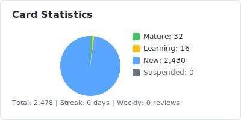

# Anki Statistics

   

## Review Activity

<picture>
  <source media="(prefers-color-scheme: dark)" srcset="output/heatmap-dark.svg">
  <source media="(prefers-color-scheme: light)" srcset="output/heatmap.svg">
  
</picture>

## Statistics

<picture>
  <source media="(prefers-color-scheme: dark)" srcset="output/stats-card-dark.svg">
  <source media="(prefers-color-scheme: light)" srcset="output/stats-card.svg">
  
</picture>

## Progress

<strong>Top Decks</strong>

| Deck | Total | Mature | New |
|------|-------|--------|-----|
| 00 CodeTop | 1,140 | 0 | 1,140 |
| 00 QA | 175 | 0 | 175 |
| 03 Redis | 127 | 0 | 127 |
| Network | 120 | 0 | 119 |
| 02 MySQL | 119 | 0 | 117 |
| 01 Java::SSM | 112 | 0 | 112 |
| 01 Java::JavaConcurrency | 111 | 9 | 98 |
| 06 Project::QJob | 82 | 10 | 72 |
| 01 Java::SpringCloud | 81 | 0 | 81 |
| 06 Project::WAsync | 79 | 0 | 79 |

