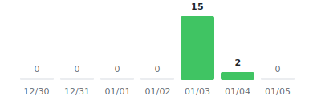
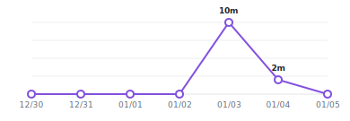
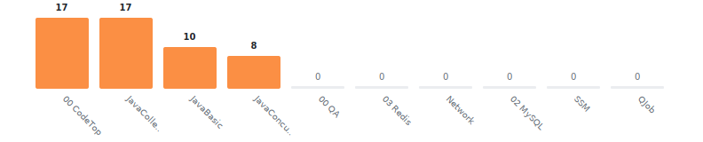

# Anki Statistics

   

## Review Activity

<picture>
  <source media="(prefers-color-scheme: dark)" srcset="output/heatmap-dark.svg">
  <source media="(prefers-color-scheme: light)" srcset="output/heatmap.svg">
  
</picture>

## This Week

<picture>
  <source media="(prefers-color-scheme: dark)" srcset="output/weekly-dark.svg">
  <source media="(prefers-color-scheme: light)" srcset="output/weekly.svg">
  
</picture>
<picture>
  <source media="(prefers-color-scheme: dark)" srcset="output/time-dark.svg">
  <source media="(prefers-color-scheme: light)" srcset="output/time.svg">
  
</picture>

## This Month

<picture>
  <source media="(prefers-color-scheme: dark)" srcset="output/cards-dark.svg">
  <source media="(prefers-color-scheme: light)" srcset="output/cards.svg">
  
</picture>

## All Decks

<picture>
  <source media="(prefers-color-scheme: dark)" srcset="output/decks-dark.svg">
  <source media="(prefers-color-scheme: light)" srcset="output/decks.svg">
  
</picture>
