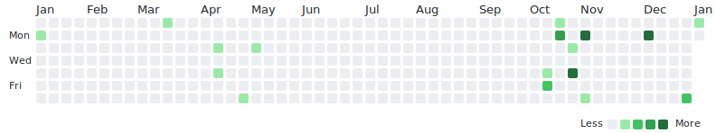
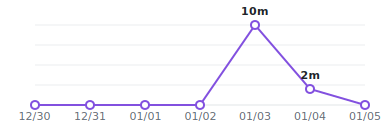

# SVG Embedding for GitHub README

This approach embeds SVG charts directly in the GitHub README with light/dark theme support.

## Example

```markdown


## Review Activity

<picture>
  <source media="(prefers-color-scheme: dark)" srcset="output/heatmap-dark.svg">
  <source media="(prefers-color-scheme: light)" srcset="output/heatmap.svg">
  
</picture>

## This Week

<picture>
  <source media="(prefers-color-scheme: dark)" srcset="output/weekly-dark.svg">
  <source media="(prefers-color-scheme: light)" srcset="output/weekly.svg">
  
</picture>
<picture>
  <source media="(prefers-color-scheme: dark)" srcset="output/time-dark.svg">
  <source media="(prefers-color-scheme: light)" srcset="output/time.svg">
  
</picture>

## This Month

<picture>
  <source media="(prefers-color-scheme: dark)" srcset="output/cards-dark.svg">
  <source media="(prefers-color-scheme: light)" srcset="output/cards.svg">
  
</picture>

## All Decks

<picture>
  <source media="(prefers-color-scheme: dark)" srcset="output/decks-dark.svg">
  <source media="(prefers-color-scheme: light)" srcset="output/decks.svg">
  
</picture>
```

## Generated Files

| File | Description |
|------|-------------|
| `output/heatmap.svg` | Review heatmap (light) |
| `output/heatmap-dark.svg` | Review heatmap (dark) |
| `output/weekly.svg` | Weekly reviews bar chart (light) |
| `output/weekly-dark.svg` | Weekly reviews bar chart (dark) |
| `output/time.svg` | Weekly time line chart (light) |
| `output/time-dark.svg` | Weekly time line chart (dark) |
| `output/cards.svg` | Monthly deck ranking (light) |
| `output/cards-dark.svg` | Monthly deck ranking (dark) |
| `output/decks.svg` | All decks progress (light) |
| `output/decks-dark.svg` | All decks progress (dark) |

## SVG Generators

| Script | Output |
|--------|--------|
| `src/heatmap_generator.py` | Heatmap SVG |
| `src/weekly_bar_generator.py` | Weekly reviews chart |
| `src/weekly_time_generator.py` | Weekly time chart |
| `src/deck_cards_generator.py` | Monthly deck ranking |
| `src/deck_svg_generator.py` | All decks progress |

## Notes

- Uses `<picture>` tag for GitHub dark/light theme support
- SVGs are generated locally by `sync.py`
- No external dependencies for rendering
